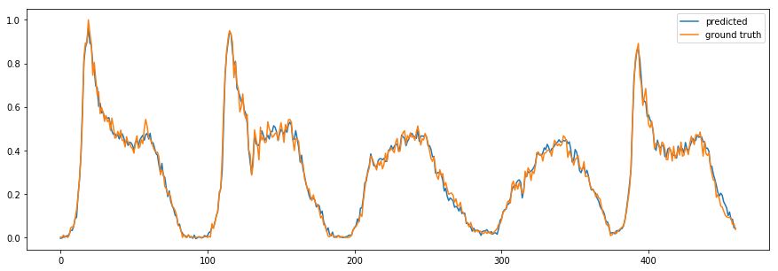
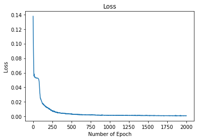
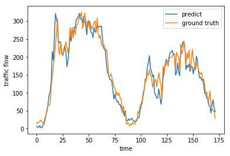
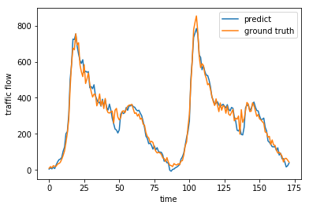

# TCA_traffic_flow_prediction

## Get started

Fork the entire directory, clone to your local disk. 

Create folders "result2168", "result2178", "result2206", "result2210". Then you can open the two jupyter notebooks and try the demo. 

## Results

### Training set after 2000 epoches: 

### Loss:

### Testing restults:

Weekends:

Weekdays:

